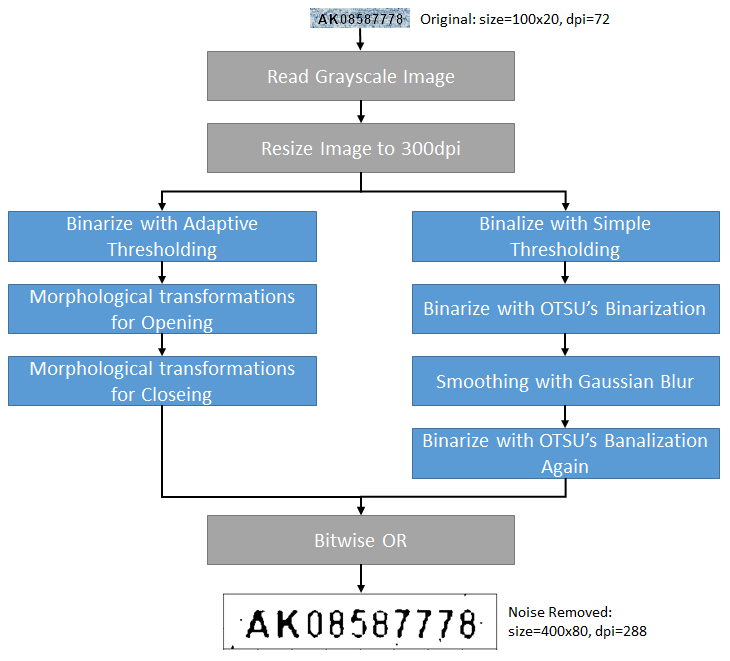

How to build end-to-end OCR solution

# Overview
In this article, I would like to introduce the end-to-end solution (from pre-process to post-process) with the working code to recognize the text using tesseract OCR engine. I think it is most important for better text recognition to binarize the input image standing for OCR engine. During this trials, I found the image that human feels good is not always good for OCR engine.

I thought I did good job to remove the background noise for one image but the OCR engine returned misreading text for around 50 images when I used the same parameters to recognize other 100 images. It was nightmare. I tried many values for the parameters by hand to get the clean images. However, the accuracy is not improved as I expected. So, I finally gave up trial and error of the parameter setting by hand.

Let me show the specification of the image to recognize;

1. The image has noisy background
1. The image has two-character alphabet and eight-digit numeric
1. The text region in the image has already cropped
1. The resolution of the image is 72dpi
1. The size of the image is 100x20
1. The font size of the text in the image is 13pt

Sample Image: We are going to recognize these small text.


I assume some familiar business use cases to read one line of text in the image like ISBN code of the books or price tags rather than read many lines of text like a document. I may say it is kind of scene text recognintion like reading the license plate rather than OCR.

# Setup

I am going to use Python 3.6.7 on VS Code for Mac.

## Install OCR engine

Install tesseract that Google providing using brew as follows;

```
$ brew install tesseract
```

You can find all installed modules with the following command. "tessdata" is the directory that has the trained data.

```
$ brew list tesseract
/usr/local/Cellar/tesseract/4.0.0/bin/tesseract
/usr/local/Cellar/tesseract/4.0.0/include/tesseract/ (20 files)
/usr/local/Cellar/tesseract/4.0.0/lib/libtesseract.4.dylib
/usr/local/Cellar/tesseract/4.0.0/lib/pkgconfig/tesseract.pc
/usr/local/Cellar/tesseract/4.0.0/lib/ (2 other files)
/usr/local/Cellar/tesseract/4.0.0/share/tessdata/ (30 files)
```

## Install Python libraries

Install all python libraries like PyOCR that is the python wrapper of the tesseract.

```
$ pip install pyocr
$ pip install numpy
$ pip install opencv-python
$ pip install matplotlib
$ pip install pillow
$ pip install Jupyter
```

# Synthesize the images for testing

We do not need to train the tesseract if we use it to recognize only alphabet and numeric. We can see enough performance using trained data that the tesseract uses by default if we do not need to recognize the unfamiliar font like Japanese Kanji font. In addition, We do not need to have a hard work to gather images for training and validation as we do not need training.

However, we need some images to validate the performance. I assume we can get the images that are used in the real business world but it is pretty bother work to add correct label as annotation to the images one by one manually. Okay, take it easy. Let's get an real image the business uses to reuse its background image, and then overwrite the text on the background.

Let's open "generate_image" with jupyter notebook. You can get both image and correct label. You can get tens of thousands of images for validation and annotations for your business if you change the code to repeat several times to synthesize the randomly generated text on background image. You can use your own background image and similar font according to your business requirements. 

Actually I strongly recommend to have 100 images at least to validate the performance.


# Remove background noise

When I worked for some OCR reader/sorter projects at NEC in late 1980s, they say the OCR performance depends on how we can get the clear image after removing the background noise. It is still so true. I can say it is too easy to recognize the text if the image have a text written by clear font on the truly white background. I assume the tesseract will show enough performance even if I input the image just converted to gray scale. However, it depends on how we can get the clear image as a pre-process to achieve the good OCR result. We need to input the image to the OCR after removing the background noise to get the clear text image.

You may imagine professional PhotoShop user when you heard "Remove Background" but we are going to remove the background noise step by step while binarizing the image with calling the OpenCV functions. There are many many functions to binarize the image but the most important thing is to remove background noise not to get image that human feels good but to get the image that OCR performs good.

The idea to remove background noise that I described in this article has already discussed in [this stackoverflow thread](https://stackoverflow.com/questions/28935983/preprocessing-image-for-tesseract-ocr-with-opencv/43493383#43493383). I would like to say many thanks to Amit Kushwaha and [his code on GitHub](https://github.com/yardstick17/image_text_reader).

In addition, this article from OpenCV official site will help you with understanding how the functions of OpenCV for noise reduction work. [Image Thresholding](https://opencv-python-tutroals.readthedocs.io/en/latest/py_tutorials/py_imgproc/py_thresholding/py_thresholding.html)



I feel removing the background noise is not deep learning but it is similar to deep learning since the general ability is important very much. OCR does not always show the good performance for other images even if it shows the good performance for a image with a certain parameters. In other word, we may see less than fifty percent of accuracy for other images that have different text on the same background even if we fine-tuned the parameters for only one image. We need to consider how generally the parameters fit for unknown images, and I can say it is almost impossible to find more than tens of thousands of combination of the threshold parameters by hand.

# Conclusion

I just describe the essentials in this article and the values of parameters might not be the best. We need to try the several parameter settings to get the clearer images that the OCR engine shows better result, and it is impossible for human beings to find the best combination of the parameters by hand.

So, You should use your computer to find the better combination like this.

1. Load a certain image
1. Set random values to the parameters
1. Try noise reduction -> OCR -> error correction
1. Validate if the accuracy is 100%. If not go back to step 2
1. Try noise reduction -> OCR -> error correction -> validate accuracy -> record result for other 100 images
1. The parameters are best if OCR shows 100% accuracy for all 100 images. Congrats!
1. Otherwise, let's go back to step 2 to try another parameters

