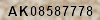
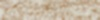
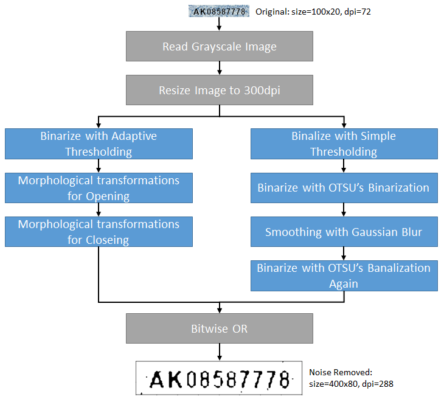
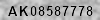
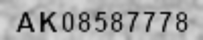
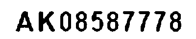
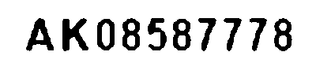
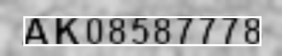

tesseract OCRでエンド・ツー・エンドのソリューションを構築する

# はじめに
この記事では、tesseractというオープンソースのOCRエンジンで文字を認識するにあたって必要となる、前処理から後処理までの一連の流れをエンド・ツー・エンドで実際のコードをベースに説明してみたいと思います。一番大事なことは今から使うOCRエンジンが認識しやすいイメージを準備することです。

この試行錯誤を始めた当初は悲惨でした。綺麗に背景除去できたと喜んで100件読ませると、全桁正解できたのは50件くらいで残る半分は1文字か2文字は誤読しているという状態で、今思うと、OCRエンジンにとって好ましいイメージというものがわかっていなかったと思います。分からないからこそ、OCR自身に「これは？」「あれは？」と何万回も聞くようにして背景除去のパラメーターを決めるようにしました。それからは、精度が目に見えて上がるようになったので、人の目でみて判断するのではなく実際にOCRにパラメーターの良し悪しを判断させることが大事だと気づきました。

さて、本記事で想定している仕様は以下の通りです。

1. 認識対象のイメージには複雑な背景模様がある
1. 認識対象の文字は英字2文字＋数字8文字の合計10文字である
1. 認識対象のイメージはすでに文字部分が切り出されている
1. 認識対象イメージの解像度は72dpiである
1. 認識対象イメージのサイズは100x20である
1. 認識対象イメージのフォントサイズは12ptである

画像例：以下のような小さくて背景もノイジーな画像からテキストを認識します。



どちらかというと、スキャン文書からの文字起こしという用途ではなく、値札あるいは本のISBNコードのような1行の文字列を読み取るといった、ありふれたビジネス上の利用シーンを想定しています。そういった意味ではOCRというよりも、風景に溶け込んでいるテキスト（Scene Text）の認識に近いのかもしれません。自動車のナンバープレート認識とか。

# 必要な環境のセットアップ

本記事では、Mac版のVS Codeを利用して作業します。Mac版のセットアップ方法を過去に記事にしていますので参考にしてください。

[Python仮想環境をVisual Studio Codeにセットアップする手順](https://qiita.com/narista/items/087c9a89880edc67b570)

## OCRエンジンのインストール
Googleが提供しているtesseracを以下のようにbrewコマンドでインストールします。

```
$ brew install tesseract
```

以下のコマンドでインストールされた一覧を取得できます。tessdataがトレーニング済みデータが格納されているディレクトリです。

```
$ brew list tesseract
/usr/local/Cellar/tesseract/4.0.0/bin/tesseract
/usr/local/Cellar/tesseract/4.0.0/include/tesseract/ (20 files)
/usr/local/Cellar/tesseract/4.0.0/lib/libtesseract.4.dylib
/usr/local/Cellar/tesseract/4.0.0/lib/pkgconfig/tesseract.pc
/usr/local/Cellar/tesseract/4.0.0/lib/ (2 other files)
/usr/local/Cellar/tesseract/4.0.0/share/tessdata/ (30 files)
```

## Pythonライブラリのインストール
tesseractのpythonラッパーであるPyOCRなど、OCRを実行するにあたって必要となるライブラリ一式をインストールします。

```
$ pip install pyocr
$ pip install numpy
$ pip install opencv-python
$ pip install matplotlib
$ pip install pillow
$ pip install Jupyter
```

# テスト用の画像を生成する

tesseractを、アルファベットと数字という仕様のもとで利用するならばトレーニングは必要ありません。よほど特殊な形状のフォントを認識したいというニーズがない限り、デフォルトで用意されているトレーニング済みのデータを利用しても十分な精度をだすことができます。また、画像認識系のタスクでいつも頭痛の種となっている学習用と検証用の画像収集で苦労する必要もありません。なんといってもトレーニングが必要ないのですから。

とはいうものの、性能を検証するために画像は必要になります。本当の業務で利用する画像を入手することはできるでしょうが、OCRの性能評価のために何百枚もの画像に写っている英字と数字の組み合わせを、人間の手でちまちまテキスト化して正解ラベルを作成するのはなかなか骨の折れる仕事になります。ですから、ここはひとつ楽をしましょう。本当の業務で使用する画像を一枚入手して背景だけを借用します。そしてテキスト部分をその上に重ねて合成してしまいましょう。

jupyter notebookでgenerate_imageを開いて実行してください。検証用画像と正解ラベル両方が簡単に手に入ります。あとは、あなたの業務に応じて背景イメージを用意し、本当の画像に似たフォントとサイズを選択し、ランダムな文字列で画像の生成を複数回繰り返す処理に変えてしまえば、何千枚でも無尽蔵にあなたの業務専用の検証用イメージと正解ラベルを作り出すことができます。

実際には、検証用データは最低でも100枚はあったほうがいいです。理由は後述します。

## 背景イメージのロード

以下のコードで背景イメージをロードします。この背景はカーペットを撮影したものです。

```Python
# Read the background image as full colored image.
background = Image.open('../dataset/sample/background100x20.jpg').convert("RGBA")
plt.imshow(background)
```

ロードされたイメージは72dpiで100x20のサイズです。



## テキストを表示する前景を準備

テキストを表示するための前景を空白のアルファチャネルとして用意します。テキストを中心揃えにするため、フォントを選択しその幅と全体的な字間の調整を考慮しながら水平方向のテキスト開始位置を決定します。一方、垂直方向はフォントの高さだけで決定できます。

```Python
# Makes a transparent foreground image for the text. (The alpha channel is zero)
foreground = Image.new('RGBA', background.size, (255,255,255,0))

# Gets a font with size 13
fnt = ImageFont.truetype('/Library/Fonts/Arial Bold.ttf', 13)

text = 'AK08587778'

# Kerning is the spacing size between characters.
kerning = 1

# Sets the start positon of the text to center the text virtically and horizontally with considering kerning
X = (foreground.size[0] - fnt.getsize(text)[0] - kerning * (len(text) - 1)) / 2
Y = (foreground.size[1] - fnt.getsize("A")[1]) / 2 

# Gets a drawing context
d = ImageDraw.Draw(foreground)
```

## テキストを背景上に描画する

テキストを、1文字ずつ水平／垂直方向の開始位置から順に前景に描画し、最終的に背景と合成して一枚の画像にします。一つの文字を描画し終わるたびに、字間とフォントの幅を考慮して次の文字の開始位置を計算し直しながら、全ての文字を描画するまで繰り返します。描画された前景のテキストをそのまま背景と合成すると輪郭がはっきりしすぎて不自然なため少しぼかしを入れて背景と馴染むようにします。

```Python
# Draw each character on the foreground 
for i in range(0, len(text)):
    w, h = fnt.getsize(text[i])
    # draw text, full opacity
    d.text((X, Y), text[i], font=fnt, fill=(0,0,0,255))
    X = X + w + kerning

# Blur the foreground to smooth the edge between foreground and background
img_blur = cv2.GaussianBlur(np.array(foreground), (1, 1), 0)

# Mix the foreground with background
out = Image.alpha_composite(background, Image.fromarray(img_blur))
print('Image Size:', out.size)
```

合成されたイメージはこちらになります。100ｘ20サイズのイメージに13ポイントの文字を10文字合成しています。老眼の進んだ僕にはにわかに判別しづらい画像です。たぶん正解率でOCRに負けます。


## 合成されたイメージを保存する

合成されたイメージは、合成に使ったテキストそのものをファイル名にして保存します。こうすることで人間の目で見てわかりますし、別途アノテーションファイルを作成する手間も不要になります。

```Python
# Save the image as a test data.
out.save('../dataset/sample/' + text + '.png')
```

実際に作成されたイメージはいかがでしょう？　なかなかそれっぽい感じのいいイメージになっているのではないかと思うのですが？

# 背景やノイズを除去する

僕がNECで公金OCR分類システムをやってた80年代末から言われていたことですが、やっぱり今でもOCRに投入する前のノイズ除去の良し悪しで勝負は決まるようです。はっきりいって、白背景に鮮明なフォントがあるならこんなに簡単なお仕事はないと思います。たぶん、二値化もせずグレースケールで読んでtesseractに投入するだけで（tesseractは内部で大津の二値化を行なっているので）そこそこの性能が出ると思います。しかし、本記事のように背景があるイメージの場合は、そういったノイズを除去してテキスト部分だけを浮き上がらせ、OCRで認識しやすい形に整えてから投入するという前処理のできが大きく性能を左右します。

背景除去と聞くとPhotoShopでごにょごにょみたいな職人技を駆使しているシーンを想像してしまいますが、実際にはOpenCVの関数を呼び出して二値化を進めていく過程で背景ノイズを除去していきます。色々なやり方があるようですが、人間の目で見て麗しい背景除去をするのではなくOCRにとって効果のある背景除去を行うという点に留意しなければなりません。本記事はエッセンスを記述しているだけですので、パラメーターの設定などはベストな値とは言えない値になっています。

ここで紹介する背景除去のアイデアは、[こちらのstackoverflowのスレッドで議題にあがっていたものです](https://stackoverflow.com/questions/28935983/preprocessing-image-for-tesseract-ocr-with-opencv/43493383#43493383)。該当アイデアと[GitHub上に彼が公開している実際のコード](https://github.com/yardstick17/image_text_reader)を紹介してくれたAmit Kushwahaさんに感謝します。



背景除去はディープラーニングではありませんが、ディープラーニングと同様に汎化性能が重視されます。一つのテキスト画像に対する背景除去がうまくいったからといって、そのパラメーター設定が他のテキスト画像でもうまくいくとは限りません。つまり一つの画像だけで背景除去を最適化しても、表面の文字が異なる画像に対する汎化性能は50%も出ないかもしれないのです。背景除去でも汎化性能を念頭に置いて、一番良い汎化性能を達成できるパラメーターを探っていくことが必要です。そして何万通りもの組み合わせの中からそれを人手で探すのは無理があると思います。

## 類似性の計算

背景除去はいくつかのステップに分けて進めていきますが、その前後でどこが変わったのか人間の目で見てわからないことが数多くあります。そういった違いを人間にもわかるようにするため前後のヒストグラムを比較して類似度を計算する関数を用意しました。

```Python
def get_similarity(img1, img2):
    hist1 = cv2.calcHist([img1], [0], None, [256], [0, 256])
    hist2 = cv2.calcHist([img2], [0], None, [256], [0, 256])
    result = cv2.compareHist(hist1, hist2, 0)
    return result
```

## パラメーター設定

本記事で利用している背景除去の流れの中で大きく影響を与えるパラメーターです。特にblock_size、C、thresholdの3つは大きく影響します。このパラメーターの組み合わせを人手で一つ一つ試しながら、見た目が綺麗／汚いという基準でOCRに投入する画像の質を探っているとしたら、それはtesseract OCRの性能を十分に生かしきっていないのではないかと思います。

```Python
resize_to = (400, 80)      # Rescale the image more than 300 dpi
block_size = 147           # Block size for adaptive thresholding. This should be positive and odd value more than 1. 
C = 31                     # The constant to subtract from mean or weighted mean
threshold = 140            # The threshold for simple thresholding
open_ksize = (5, 5)        # The kernel size to remove white patch in black region
close_ksize = (3, 3)       # The kernel size to remove black patch in white region
blur_ksize = (5, 5)        # The Gaussian kernel size to set blur. This should be positive and odd value
```

## グレースケールでイメージを読み込み

合成されたイメージをグレースケールで読み込みます。

```Python
img_generated = cv2.imread('../dataset/sample/AK08587778.png', cv2.IMREAD_GRAYSCALE)
print('image shape', img_generated.shape)
cv2.imwrite('../doc_resources/grayscale_image.png', img_generated)
plt.gray()
plt.imshow(img_generated)
```



## イメージのリサイズ

tessaractの推奨解像度は300dpiですが、投入するイメージは72dpiで1/4の解像度しかありません。そこで縦横を4倍に拡大して300dpi相当までイメージサイズを広げます。この時のポイントは拡大時の補間をどうするかですが、本記事では線形補間を利用します。

```Python
img_resized = cv2.resize(img_generated, resize_to, interpolation = cv2.INTER_LINEAR)
print('resize to', img_resized.shape)
print('similarity:', get_similarity(img_generated, img_resized))
cv2.imwrite('../doc_resources/resized_image.png', img_resized)
plt.imshow(Image.fromarray(img_resized))
```

similarity: 0.8735521030773739



## 異なる背景除去手順で作った二つの二値画像でホワイト部分を確定させる
背景除去にはいくつかの方法がありますが、本記事ではAdaptive Thresholdを利用した方法と、シンプルな閾値を用いた方法の2種類で二値画像を二つ作ります。できあがった二つの二値画像のビット単位OR（どちらかのビットがオンならば白とする）をとることで背景の白い部分を確定させます。結果として文字が細くなる傾向にありますが、そのぶんだけノイズの除去率は高くなるようなのでこれを採用します。

### Adaptive Thresholdを使う
Adaptive Thresholdは、イメージの部分ごとに異なる明るさに応じて異なる閾値を適用するアルゴリズムを持っています。そのため、明るさが部分ごとに異なるイメージを二値化する際に、同じ閾値を全体イメージに適用する単純な二値化より良い結果を得ることができます。

```Python
img_adaptive = cv2.adaptiveThreshold(img_resized, 255, cv2.ADAPTIVE_THRESH_GAUSSIAN_C, cv2.THRESH_BINARY, block_size, C)
print('similarity:', get_similarity(img_resized, img_adaptive))
cv2.imwrite('../doc_resources/adaptive_image.png', img_adaptive)
plt.imshow(img_adaptive)
```

similarity: -0.04252420091227238



意外に綺麗な背景除去ができました。続いて、黒い部分の白い点を除去できるか試して見ましょう。

```Python
img_morph_open = cv2.morphologyEx(img_adaptive, cv2.MORPH_OPEN, np.ones(open_ksize, np.uint8))
print('similarity:', get_similarity(img_morph_open, img_adaptive))
cv2.imwrite('../doc_resources/morph_open_image.png', img_morph_open)
plt.imshow(img_morph_open)
```

ｓimilarity: 0.9999880218901825


見た目では分かりませんが、類似度を見ると1.0ではないので多少なりとも黒い部分の白点を除去できていることがわかります。では、白い部分の黒い点を除去できるか試して見ましょう。

```Python
img_morph_close = cv2.morphologyEx(img_morph_open, cv2.MORPH_CLOSE, np.ones(close_ksize, np.uint8))
print('similarity:', get_similarity(img_morph_open, img_morph_close))
cv2.imwrite('../doc_resources/morph_close_image.png', img_morph_close)
plt.imshow(img_morph_close)
```

similarity: 0.9999998117816038


こちらも見た目では分かりませんが、類似度を見ると1.0ではないので白い部分の黒点が多少は除去できていることがわかります。Adaptive Threshold側のイメージはこれで確定です。

### Simple Thresholdを使う

では今度は単純な二値化を使って背景を除去して見ましょう。あるドットの値が指定された閾値より上か下かだけで二値化します。周りの明るさなどの可変条件はありません。

```Python
result, img_threshold = cv2.threshold(img_resized, threshold, max_value, cv2.THRESH_BINARY)
print('similarity:', get_similarity(img_resized, img_threshold))
plt.imshow(img_threshold)
```

similarity: -0.04302254591157132


背景ノイズはかなり除去されていますが、パッと見ただけだと文字の境界部分にギザギザがめだちます。ここに大津の二値化という処理をかけて効果をみましょう。

```Python
result, img_OTSU = cv2.threshold(img_resized, 0, 255, cv2.THRESH_BINARY + cv2.THRESH_OTSU)
print('similarity:', get_similarity(img_OTSU, img_threshold))
cv2.imwrite('../doc_resources/OTSU1_image.png', img_OTSU)
plt.imshow(img_OTSU)
```

similarity: 0.9995666975138376


大津の二値化をかけたあと何が変わったのでしょうか？　少し白い部分が増えたようにも見えますが人の目で見てわかるほどの変化は認められません。類似度を見て見ると、ごくわずかな変化がありますがこの変化が好ましいものかどうかはわかりません。ギザギザを低減するためこの画像にぼかしをかけてみます。

```Python
img_blur = cv2.GaussianBlur(img_OTSU, blur_ksize, cv2.BORDER_CONSTANT)
print('similarity:', get_similarity(img_OTSU, img_blur))
cv2.imwrite('../doc_resources/Blur_image.png', img_blur)
plt.imshow(img_blur)
```

similarity: 0.9895459819028379


ギザギザはかなり補正されたようですが、この画像はグレースケールになっています。これを大津の二値化を使って再び二値画像に変換します。

```Python
result, img_OTSU2 = cv2.threshold(img_blur, 0, 255, cv2.THRESH_BINARY + cv2.THRESH_OTSU)
print('similarity:', get_similarity(img_OTSU2, img_blur))
cv2.imwrite('../doc_resources/OTSU2_image.png', img_OTSU2)
plt.imshow(img_OTSU2)
```

similarity: 0.9888212847226167


少し字が細くなりましたがギザギザがかなり少なくなりました。これで、Adaptive THresholdを使った画像とSimple Thresholdを使った画像の2つが用意できましたので、この二つの画像のBitwise ORをとって画像の中の白地部分を確定させようと思います。

```Python
img_bitwise = cv2.bitwise_or(img_OTSU2, img_morph_close)
print('similarity(to OTSU2):', get_similarity(img_OTSU2, img_bitwise))
print('similarity(to Morph):', get_similarity(img_morph_close, img_bitwise))
cv2.imwrite('../doc_resources/bitwiseOr.png', img_bitwise)
plt.imshow(img_bitwise)
```

similarity(to OTSU2): 0.9999935428445347</br>
similarity(to Morph): 0.9999436731322505



AdaptiveとSimple両方の二値化で作られた画像とBitwiseORで作られた画像の類似度をみると、このイメージに対してはどちらかというとSimpleな二値化で作られた画像に寄った画像ができあがったようです。

# 文字列を認識する
文字列を認識します。このとき、"tesseract_layout"パラメーターにどの値をセットするべきかについては [Page segmentation method](https://github.com/tesseract-ocr/tesseract/wiki/ImproveQuality#page-segmentation-method) を参照してください。今回は10文字のブロックを文字列として認識したいので「6」をセットしました。このような10文字のブロックを認識する場合には6もしくは7を指定すると他の値を指定するよりも良い認識性能を発揮してくれます。

```Python
tools = pyocr.get_available_tools()
tool = tools[0]

# Recognize the text.
lines = tool.image_to_string(Image.fromarray(img_bitwise), lang='eng', builder=pyocr.builders.LineBoxBuilder(tesseract_layout=7))

print('num of line:', len(lines))
print('content:', lines[0].content)
print('num of word box:', len(lines[0].word_boxes))
print('confidence:', lines[0].word_boxes[0].confidence)
print('position:', lines[0].position)

# Show the rectangle around the text.
img_rectangle = Image.fromarray(img_resized)
draw = ImageDraw.Draw(img_rectangle)
draw.rectangle(lines[0].position, outline=255, width=3)
plt.imshow(img_rectangle)
```

num of line: 1</br>
content: AK08587778</br>
num of word box: 1</br>
confidence: 87</br>
position: ((33, 23), (370, 65))



もしも設定されているパラメーターが適切でない場合、象文字列の周りにノイズが残ってしまうことがあり、認識対象の文字列を囲う矩形は文字列の範囲より広いエリアを囲うことになります。

# 誤読補正
この誤読補正処理ではシンプルに大文字の英字と数字以外を削除するようにしています。実際には英字部分に数字の1が入っていたら英字のIに変換するなどの独自の変換ロジックを用意する必要があります。

```Python
# Very simple replacement for the misreading characters. Remove characters except uppercase alphabet and numeric.
m = re.findall("[A-Z0-9]", lines[0].content)
if m:
    print(''.join(m))
else:
    print('None')
```

# おわりに

ここで紹介している流れはあくまでもエッセンスですし、使用しているパラメーターも最適なものとは限りません。tesseract OCRエンジンに、優れた汎化性能を発揮させるためには適切な背景除去パラメーターの組み合わせが必要ですが、それを試行錯誤を繰り返しながら手で見つけだすのは困難だと思います。そこで、以下のような最適パラメーターをランダムに探索する処理を作って、人手で試行錯誤するよりもはるかに多くの組み合わせの中からより良いパラメーターの組み合わせを発見する必要があります。

1. 特定のイメージをロード
1. ランダムな値をパラメーターにセット
1. ノイズ除去 → OCR → 補正を実行
1. 認識率が100％だったか確認し、そうでなければステップ2に戻る
1. 100％だった場合、他の100件のイメージに対してノイズ除去 → OCR → 補正を実行し精度を記録していく
1. 全イメージの平均精度が100％であれば、ベストなパラメーターを発見したことになる。おめでとうございます！
1. そうでなければ、再びステップ2に戻ってより良い平均精度を示すパラメーターを探索するループを続ける
